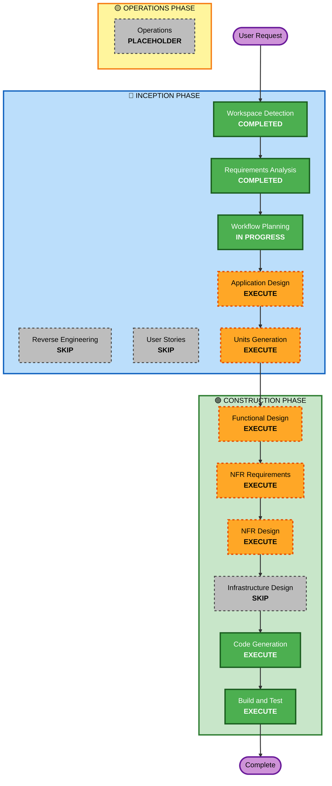

# Execution Plan

## Detailed Analysis Summary

### Change Impact Assessment
- **User-facing changes**: No — backend only, API consumed by frontend clients
- **Structural changes**: Yes — new project from scratch
- **Data model changes**: Yes — 14+ new entities with relationships
- **API changes**: Yes — full RESTful API surface for 12 modules
- **NFR impact**: Yes — security, performance, transactional integrity

### Risk Assessment
- **Risk Level**: Medium — multiple modules, moderate complexity, well-defined domain
- **Rollback Complexity**: Easy — greenfield, no existing system to protect
- **Testing Complexity**: Moderate — 12 modules with cross-cutting concerns

## Workflow Visualization

## Phases to Execute

### 🔵 INCEPTION PHASE
- [x] Workspace Detection (COMPLETED)
- [x] Reverse Engineering (SKIPPED — Greenfield)
- [x] Requirements Analysis (COMPLETED)
- [x] User Stories (SKIPPED — Backend-only, detailed feature list already provided, no multi-persona complexity)
- [x] Workflow Planning (COMPLETED)
- [x] Application Design — **COMPLETED**
  - **Rationale**: New components and services needed across 12 modules. Service layer, component methods, and business rules need definition before coding.
- [x] Units Generation — **COMPLETED**
  - **Rationale**: 12+ modules require structured decomposition into units of work for organized implementation.

### 🟢 CONSTRUCTION PHASE
- [x] Functional Design — **COMPLETED** (Units 1 & 2)
  - **Rationale**: Complex business logic (scan validation, KIT/lunch/dinner rules, hall tracking, payment processing, category restrictions). Data models and business rules need detailed design.
- [x] NFR Requirements — **COMPLETED** (Units 1 & 2)
  - **Rationale**: Security extension enforced (15 rules to verify), performance targets defined, transactional integrity required via UOW pattern.
- [x] NFR Design — **COMPLETED** (Units 1 & 2)
  - **Rationale**: Security patterns (JWT, RBAC, input validation, rate limiting) must be incorporated into the design per SECURITY rules.
- [x] Infrastructure Design — **SKIPPED**
  - **Rationale**: No cloud/deployment infrastructure specified. Pure backend code with local SQL Server. No IaC or cloud resource mapping needed.
- [x] Code Generation — **COMPLETED** (All 9 Units)
  - **Rationale**: Implementation with Repository + UOW pattern in FastAPI/SQLAlchemy.
- [x] Build and Test — **COMPLETED** (33 tests passing)
  - **Rationale**: Build verification, unit tests, integration tests.

### 🟡 OPERATIONS PHASE
- [x] Operations — PLACEHOLDER
  - **Rationale**: Future deployment and monitoring workflows.

## Execution Summary

| | Execute | Skip |
|---|---|---|
| 🔵 INCEPTION | Application Design, Units Generation (COMPLETED) | Reverse Engineering, User Stories |
| 🟢 CONSTRUCTION | Functional Design, NFR Req, NFR Design, Code Gen, Build & Test (COMPLETED) | Infrastructure Design |
| **Total** | **7 of 7 stages** | **3 skipped** |

## Success Criteria (ALL MET)
- **Primary Goal**: Working backend with Repository + UOW pattern covering all 12 modules
- **Key Deliverables**: 85+ files — FastAPI project, 15 models, 15 repos, 17 services, 16 routers, 4 middleware, 33 tests
- **Quality Gates**: All SECURITY rules verified, UOW transactional integrity validated, RESTful API with auto-docs
